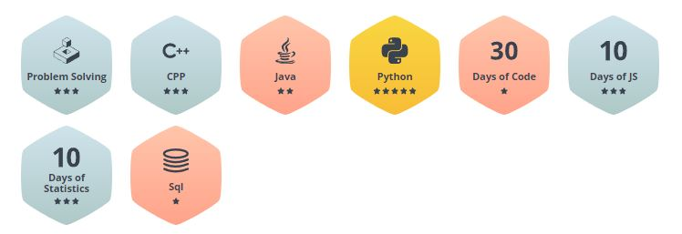
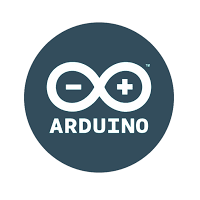
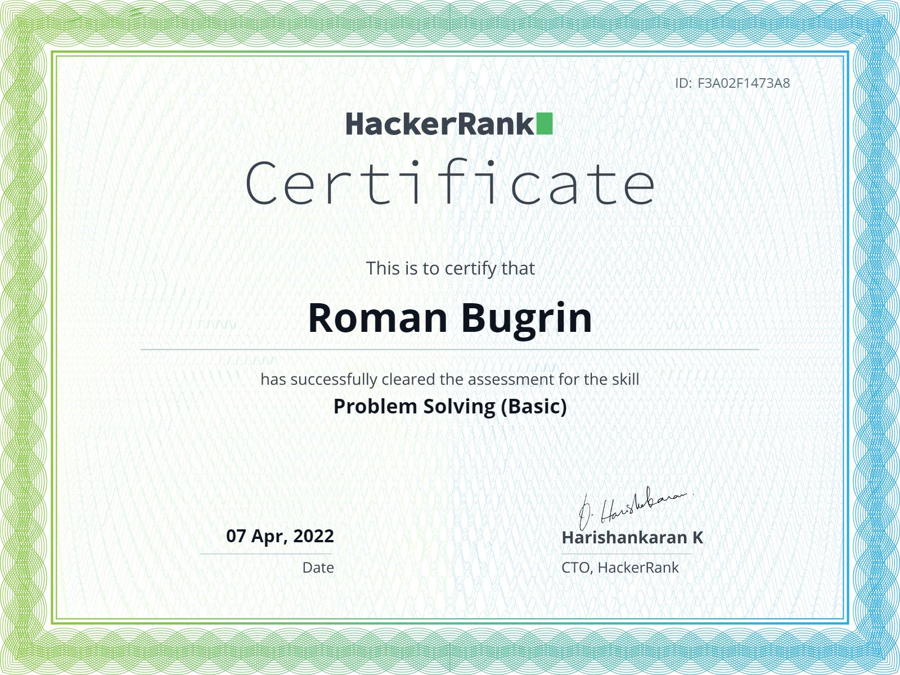

<h1 align="center">Hi there, I'm Roman </h1>
<h3 align="center">
    If you here please give me a star
</h3>

    

### Connect with me:

### My languages:

    
    
    
    
    
    
    
    
    
    

### My profile at HackerRank: https://www.hackerrank.com/roma11_11

    

<!--
**Good4lien/Good4lien** is a ✨ _special_ ✨ repository because its `README.md` (this file) appears on your GitHub profile.

Here are some ideas to get you started:

- 🔭 I’m currently working on ...
- 🌱 I’m currently learning ...
- 👯 I’m looking to collaborate on ...
- 🤔 I’m looking for help with ...
- 💬 Ask me about ...
- 📫 How to reach me: ...
- 😄 Pronouns: ...
- ⚡ Fun fact: ...
-->
